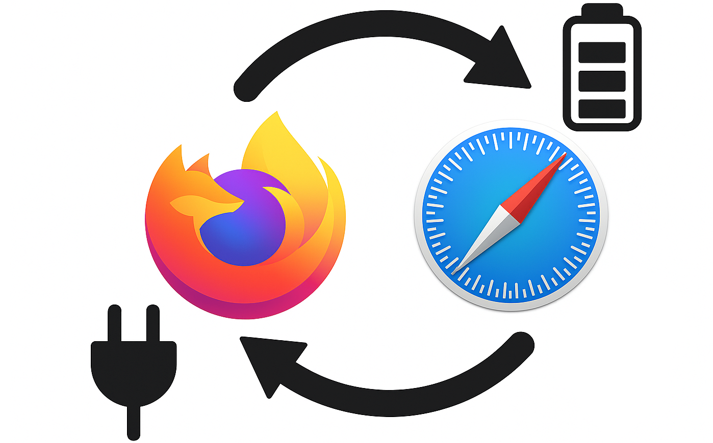

# Default Browser Switcher Shortcut for MacOS



This macOS Shortcut automatically switches your default web browser based on your battery charging status and your preferences.

## But... why?

This shortcut was designed to help MacBook users optimize their battery life by making it easy to switch between browsers depending on power status. When running on battery power, you might want to use more energy-efficient browsers like Safari, which is optimized for macOS and typically consumes less battery. When plugged in, you can automatically switch to feature-rich browsers like Chrome or Firefox without worrying about power consumption.

## How it works

1. Checks your battery state using the [Actions](https://apps.apple.com/app/id1586435171) app by [Sindre Sorhus](https://github.com/sindresorhushttps:/).
2. If your Mac **is not charging** (`unplugged`):

   - Shows a list of available browsers;
   - Lets you choose which browser to set as default;
   - Sets the selected browser as default using:

   ```bash
   /opt/homebrew/bin/defaultbrowser <selected-browser>
   ```
3. If your Mac **is charging**:

   - Shows a list of available browsers
   - Lets you choose which browser to set as default for charging state
   - Sets the selected browser as default using:

   ```bash
   /opt/homebrew/bin/defaultbrowser <selected-browser>
   ```

## Key Features

- Dynamic browser selection for both charging and non-charging states;
- Lists all available browsers installed on your system;
- Remembers your last selection for each power state;
- Supports any browser that can be set as default on macOS.

## Dependencies

Make sure you have the following installed and configured:

- [Actions app](https://apps.apple.com/app/id1586435171) (free) by Sindre Sorhus;
- [`defaultbrowser`](https://github.com/kerma/defaultbrowser) CLI tool installed at `/opt/homebrew/bin/defaultbrowser`.

## Notes

- Tested with the Actions app version`3.7.0`.

## Installation

1. Import the shortcut via [iCloud link](https://www.icloud.com/shortcuts/9fc399a1ea2e4ab6a9580ac72649442d) or `.shortcut` file;
2. Install [Actions app](https://apps.apple.com/app/id1586435171);
3. Grant permissions when prompted;
4. Install Homebrew (if you haven't already):

   ```bash
   /bin/bash -c "$(curl -fsSL https://raw.githubusercontent.com/Homebrew/install/HEAD/install.sh)"
   ```

   For more information, visit: [https://brew.sh/](https://brew.sh/)
5. Install `defaultbrowser` using Homebrew:

   ```bash
   brew install defaultbrowser
   ```
6. Confirm that `/opt/homebrew/bin/defaultbrowser` exists and is executable;
7. Run the shortcut!

---

Feel free to modify the shell script or the shortcut to fit your browser preferences or UI workflow.

Enjoy your automatic browser switching! 🚀

## Download Options

You can download the shortcut in two formats:

1. `.shortcut` file: [Default Browser.shortcut](shortcut/default-browser.shortcut)

   - Direct import into the Shortcuts app;
   - Recommended for most users.
2. `.json` file: [default-browser-changer.json](shortcut/default-browser.json)

   - Useful for developers or manual modifications.
